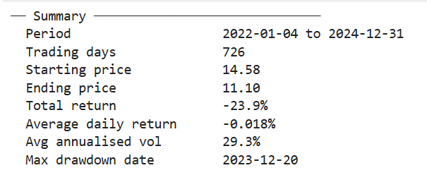

# Financial Time Series Analysis of A-Share Stocks

## Project Objective
This project uses Python to retrieve and analyse historical A-share stock market data. 
The analysis includes moving averages, return calculations, rolling volatility estimation, and data visualisation to explore market trends and risk characteristics.

## What this project does
- Retrieves 3-year daily price data via the akshare API
- Calculates MA20, MA60 and 20-day annualised rolling volatility
- Visualises price trends and volatility patterns

## Tools used
Python · pandas · matplotlib · akshare

## Sample output

